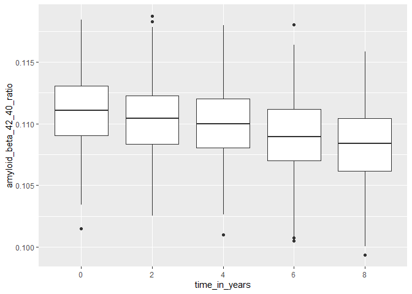

Homework 2
================
Shaolei Ma
2023-09-30

# Problem 1

First, clean the data in pols-month.csv.

``` r
pols_df =
  read_csv("data/fivethirtyeight_datasets/pols-month.csv") |> 
  janitor::clean_names() |> 
  separate(mon, into = c("year", "month", "day"), sep = "-", 
           convert = T) |> # convert to integers
  arrange(year, month) |> # order before months are replaced with names
  mutate(
    month = month.abb[month], # change to abbr to merge with unemployment data set
    president = case_when(
    prez_dem == 1 ~ "dem",
    prez_gop == 1 ~ "gop"
    )) |> 
  select(-prez_dem, -prez_gop, -day) |> 
  relocate(year, month, president)
```

    ## Rows: 822 Columns: 9
    ## ── Column specification ────────────────────────────────────────────────────────
    ## Delimiter: ","
    ## dbl  (8): prez_gop, gov_gop, sen_gop, rep_gop, prez_dem, gov_dem, sen_dem, r...
    ## date (1): mon
    ## 
    ## ℹ Use `spec()` to retrieve the full column specification for this data.
    ## ℹ Specify the column types or set `show_col_types = FALSE` to quiet this message.

Second, clean the data in snp.csv using a similar process to the above.

``` r
snp_df = 
  read_csv("data/fivethirtyeight_datasets/snp.csv") |> 
  janitor::clean_names() |> 
  mutate(date = as.Date(date,
                        format = "%m/%d/%y")) |> # change to date format
  mutate(date = ifelse(
    date > Sys.Date(),
    format(date, "19%y-%m-%d"),
    format(date)
  )) |> # correct the century
  separate(date, into = c("year", "month", "day"), sep = "-", 
           convert = T) |> 
  arrange(year, month) |>
  mutate(month = month.abb[month]) |> 
  select(-day) |> 
  relocate(year, month)
```

    ## Rows: 787 Columns: 2
    ## ── Column specification ────────────────────────────────────────────────────────
    ## Delimiter: ","
    ## chr (1): date
    ## dbl (1): close
    ## 
    ## ℹ Use `spec()` to retrieve the full column specification for this data.
    ## ℹ Specify the column types or set `show_col_types = FALSE` to quiet this message.

Third, tidy the unemployment data so that it can be merged with the
previous datasets.

``` r
unemployment_df =
  read_csv("data/fivethirtyeight_datasets/unemployment.csv") |> 
  pivot_longer(
    Jan:Dec,
    names_to = "month",
    values_to = "unemploy_rate"
  ) |> 
  janitor::clean_names()
```

    ## Rows: 68 Columns: 13
    ## ── Column specification ────────────────────────────────────────────────────────
    ## Delimiter: ","
    ## dbl (13): Year, Jan, Feb, Mar, Apr, May, Jun, Jul, Aug, Sep, Oct, Nov, Dec
    ## 
    ## ℹ Use `spec()` to retrieve the full column specification for this data.
    ## ℹ Specify the column types or set `show_col_types = FALSE` to quiet this message.

Join the datasets by merging snp into pols, and merging unemployment
into the result.

``` r
result_df = 
  pols_df |> 
  left_join(snp_df,
            by = join_by(year, month)) |> 
  left_join(unemployment_df,
            by = join_by(year, month))
```

The cleaned data set “pols-month” contains 822 observations of 9
variables related to the number of national politicians who are
democratic or republican at any given time from 1947 to 2015. The
cleaned data set “snp” contains 787 observations of 3 variables related
to Standard & Poor’s stock market index (S&P), often used as a
representative measure of stock market as a whole, from 1950 to 2015.
The cleaned data set “unemployment” contains 816 observations of 3
variables related to the unemployment rate in any given month from 1948
to 2015.  
For the resulting data set, it contains 822 observations of 11 variables
related to all three parts of information mentioned above in a given
month from Jan, 1947 to Jun, 2015. Specifically, the `president`
variable indicates whether the president was republican (gop) or
democratic (dem) on the associated date; the `close` variable indicates
the closing values of the S&P stock index on the associated date; the
`unemploy_rate` variable indicates the percentage of unemployment on the
associated date.

# Problem 2

Read and clean the Mr. Trash Wheel sheet:

``` r
mr_trash_wheel_df = 
  read_excel("data/202207 Trash Wheel Collection Data.xlsx", sheet = "Mr. Trash Wheel", range = "A2:M550") |> 
  janitor::clean_names() |> # use reasonable variable names
  drop_na(dumpster) |> # omit rows that do not include dumpster-specific data
  mutate(homes_powered = weight_tons * 500 / 30,
         year = as.numeric(year), # alter the type of year
         name = "Mr") # add a column to specify
```

Use a similar process to import, clean, and organize the data for
Professor Trash Wheel and Gwynnda.

``` r
prof_trash_wheel_df = 
  read_excel("data/202207 Trash Wheel Collection Data.xlsx", sheet = "Professor Trash Wheel", range = "A2:L97") |> 
  janitor::clean_names() |> # use reasonable variable names
  drop_na(dumpster) |> # omit rows that do not include dumpster-specific data
  mutate(homes_powered = weight_tons * 500 / 30,
         name = "Professor")

gwy_trash_wheel_df = 
  read_excel("data/202207 Trash Wheel Collection Data.xlsx", sheet = "Gwynnda Trash Wheel", range = "A2:J110") |> 
  janitor::clean_names() |> # use reasonable variable names
  drop_na(dumpster) |> # omit rows that do not include dumpster-specific data
  mutate(homes_powered = weight_tons * 500 / 30,
         name = "Gwynnda")
```

Then, combine the three datasets.

``` r
trash_wheel_df = 
  mr_trash_wheel_df |> 
  full_join(prof_trash_wheel_df) |> 
  full_join(gwy_trash_wheel_df) |> 
  relocate(name) # put the name of the trash wheel front
```

    ## Joining with `by = join_by(dumpster, month, year, date, weight_tons,
    ## volume_cubic_yards, plastic_bottles, polystyrene, cigarette_butts,
    ## glass_bottles, grocery_bags, chip_bags, homes_powered, name)`
    ## Joining with `by = join_by(dumpster, month, year, date, weight_tons,
    ## volume_cubic_yards, plastic_bottles, polystyrene, cigarette_butts,
    ## homes_powered, name)`

The three given data sets are all related to the total weight and volume
of the trash, the number of different waste products, the number of the
dumpster, and the number of households the trash equates to in terms of
electricity on a given date.  
Specifically, the cleaned “Mr. Trash Wheel” data set contains 547
observations of 15 variables from May, 2014 to July, 2022. The cleaned
“Professor Trash Wheel” data set contains 94 observations of 14
variables from January, 2017 to July, 2022. the cleaned “Gwynnda Trash
Wheel” data set contains 106 observations of 12 variables from July,
2021 to July, 2022.  
For the resulting dataset, it contains 747 observations of 16 variables,
among which the `name` variable marks the trash wheel’s name (Mr,
Professor, Gwynnda). It can be concluded that the total weight of trash
collected by Professor Trash Wheel is 190.12 and the total number of
cigarette butts collected by Gwynnda in July of 2021 is 16300.

# Problem 3

Import, clean, and tidy the dataset of baseline demographics.

``` r
mci_baseline_df = 
  read_csv("data/data_mci/MCI_baseline.csv", skip = 1, # skip the first row
           na = c(".", "NA")) |> # treat the missing value as NA
  janitor::clean_names() |> 
  mutate(
    sex = case_match(
      sex,
      1 ~ "Male",
      0 ~ "Female"
    ),
    apoe4 = case_match(
      apoe4,
      1 ~ "APOE4 carrier",
      0 ~ "APOE4 non-carrier"
    )
  ) |> 
  # the MCI onset happens after baseline
  filter(current_age < age_at_onset | is.na(age_at_onset) == 1)
```

    ## Rows: 483 Columns: 6
    ## ── Column specification ────────────────────────────────────────────────────────
    ## Delimiter: ","
    ## dbl (6): ID, Current Age, Sex, Education, apoe4, Age at onset
    ## 
    ## ℹ Use `spec()` to retrieve the full column specification for this data.
    ## ℹ Specify the column types or set `show_col_types = FALSE` to quiet this message.

For the data cleaning, first I skipped the first row which contains
notes for the columns, and treated the missing values as NA for
convenience afterwards. The `case_match` step converts the numerical
values of the `sex` and `apoe4` variables to their original meanings for
readability. In the end, I compared the `current_age` variable and
`age_at_onset` variable to ensure the MCI onset happens after baseline.
After cleaning, the data set contains 479 observations of 6 variables.  
From the data set, it could be concluded that 483 participants in total
were recruited, among which 479 participants met the criteria, and 93
develop MCI. After the participants who do not meet the criteria are
removed, the average baseline age is 65.03, and 30% of women in the
study are APOE4 carriers.

Similarly, import, clean, and tidy the dataset of longitudinally
observed biomarker values.

``` r
mci_amyloid_df = 
  read_csv("data/data_mci/mci_amyloid.csv", skip = 1, # skip the first row
           na = c("NA", "Na")) |>
  janitor::clean_names() |> 
  pivot_longer(
    baseline:time_8,
    names_to = "time_in_years",
    names_prefix = "time_",
    values_to = "amyloid_beta_42_40_ratio"
  ) |> 
  mutate( # change baseline to 0 year
    time_in_years = replace(time_in_years, time_in_years == "baseline", 0),
    amyloid_beta_42_40_ratio = as.numeric(amyloid_beta_42_40_ratio)
  )
```

    ## Rows: 487 Columns: 6
    ## ── Column specification ────────────────────────────────────────────────────────
    ## Delimiter: ","
    ## dbl (6): Study ID, Baseline, Time 2, Time 4, Time 6, Time 8
    ## 
    ## ℹ Use `spec()` to retrieve the full column specification for this data.
    ## ℹ Specify the column types or set `show_col_types = FALSE` to quiet this message.

For the data cleaning, first I skipped the first row which contains
notes for the columns, and treated “Na” and “NA” both as NA values
because there is an “Na” value inside the “Baseline” variable. Then I
converted the five variables measuring the ratio at a given time into
two variables named “time_in_years” and “amyloid_beta_42_40_ratio”.
After cleaning, the data set contains 2435 observations of 3 variables.
The ratio distribution for different years is illustrated below:

``` r
mci_amyloid_df |> 
  ggplot(aes(y = amyloid_beta_42_40_ratio, x = time_in_years)) + 
  geom_boxplot()
```

    ## Warning: Removed 172 rows containing non-finite values (`stat_boxplot()`).

<!-- -->

From the boxplot, it could be concluded that as the number of years
increases, the ratio tends to drop in overall.

## Compare the two datasets.

Check whether some participants appear in only the baseline or amyloid
datasets.

``` r
all_participants_df =
  mci_baseline_df |> 
  full_join(mci_amyloid_df, by = join_by(id == study_id),
            keep = T) # keep both id and study_id for comparision
```

Then, 80 participants are only in the amyloid datset, 8 participants are
only in the baseline datset.  
Retain only the participants who appear in both datasets.

``` r
both_participants_df = 
  mci_baseline_df |> 
  inner_join(mci_amyloid_df, by = join_by(id == study_id))
write_csv(both_participants_df, "data/data_mci/mci_result.csv") # export
```

The result contains 2355 observations of 8 variables related to the
participants’ baseline demographics and amyloid $\beta$ 42/40 ratio
measured every two years from the baseline to the eighth year. Among the
471 participants, 205 are female, 142 are APOE4 carriers. The average
current age at baseline is 65.05, and the average length of education at
baseline is 16.38 years.
